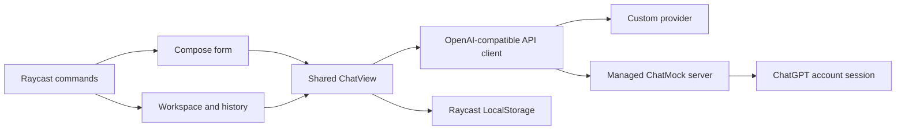

# Relay AI design

Last updated 13 September 2026. Relay is a native Raycast extension, so lists, forms, Markdown details, metadata, semantic colors, and action panels inherit the user's Raycast appearance and keyboard behavior.

## Product goals

Relay should make common AI text work fast without hiding control from the user. The implementation follows five priorities:

1. Reliable streaming with cancellation, retry, readable failures, UTF-8 handling, and JSON fallback.
2. One conversation experience shared by the workspace, Quick Ask, prompts, and selected-text commands.
3. Clear separation between model reasoning and the answer presented to the user.
4. Useful local organization through search, history, pins, titles, and reusable prompts.
5. A self-contained ChatMock setup that does not require terminal commands, global Python, or administrator access.

## Research informing the scope

- [Raycast AI Chat](https://manual.raycast.com/ai/ai-chat) informed persistent history and continuation.
- [PromptLab](https://www.raycast.com/HelloImSteven/promptlab) informed reusable workflows and custom prompts.
- [ChatGPT for Raycast](https://www.raycast.com/abielzulio/chatgpt) informed quick access and history controls.
- [Raycast AI presets](https://www.raycast.com/changelog/macos/1-72-0) informed explicit instructions and model selection before submission.
- [ChatMock](https://github.com/RayBytes/ChatMock) defines the managed provider and authentication flow.
- [uv managed Python](https://docs.astral.sh/uv/guides/install-python/) provides the isolated runtime used by automatic setup.

Early research also reviewed Sider and Merlin. Repository inspection established Raycast as the product surface, so the final design favors native Raycast patterns over browser-extension UI patterns.

## User experience

The workspace groups launch actions before saved work, then separates pinned and recent conversations. Blue represents conversations, purple prompts, orange models, yellow pins, and semantic status colors indicate responding, ready, stopped, or failed states.

Every generation uses the same response view. While waiting for the first token, Relay shows the active model. Reasoning appears in a quoted **Thinking** section and streams independently from the **Answer** section. Stop is the primary action during generation. Continue is primary after success; Retry becomes primary after cancellation or failure.

Selected-text workflows capture the selection once, place it in an editable form, and require an explicit send. Generated text is never inserted into another application automatically. Selection conversations use a short excerpt in their history title so repeated actions remain distinguishable.

Empty, disconnected, failed, stopped, setup, and history-disabled states all provide a next action. If model discovery fails, the configured fallback remains available.

## Architecture

`ChatView` owns the active request and response state. `api.ts` selects the managed or custom connection, adds the optional system prompt, and passes the response to the streaming parser. `stream.ts` accepts SSE and JSON, preserves split UTF-8 sequences, separates reasoning from visible output, and propagates cancellation. `storage.ts` stores each conversation under its own key to prevent concurrent chats from overwriting one another.

Raycast development mode can clean up and remount React effects immediately. Relay defers request cancellation for one task and cancels that pending abort when the view remounts. Real navigation still aborts the request. Initial reads in selected-text commands are likewise guarded so the development remount does not capture the selection twice.

## Automatic ChatMock setup

The setup view combines installation, browser sign-in, local server startup, connection activation, and model selection. It supports progress, cancellation, reauthentication, status refresh, log access, server stop, and returning to custom API settings.

ChatMock is pinned to PyPI version 1.40. uv is pinned to version 0.12.13, and every supported archive has an embedded SHA-256 digest from the upstream release metadata. Relay downloads archives directly and never executes a remote shell installer.

The runner binds to loopback port 8317 and requires a random 256-bit local access key. Authenticated health and stop endpoints allow Relay to identify and control its server without trusting a stored process ID. A setup lock prevents overlapping installation or login operations. Managed and custom model defaults use separate storage keys.

## Data boundaries

The provider receives conversation messages and the optional system prompt. Raycast LocalStorage holds conversations, custom prompts, setup state, and model defaults. The managed ChatMock account session stays in ChatMock's private support directory. Conversation exports exclude API keys and account credentials.

History is optional. Turning it off prevents future writes without deleting existing records. Partial streamed output is preserved after cancellation or a provider failure so useful work is not lost.

## Deferred scope

Browser control, autonomous tool execution, images, attachments, provider-specific feature comparisons, synchronization, and collaborative history need contracts beyond the current OpenAI-compatible text interface. They remain outside this release.
